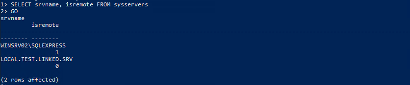
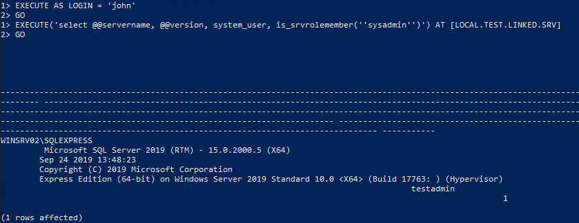

# Attacking Common Services - Hard

This lab is an internal server that manages files and working materials, such as forms. There is also a database with an unknown purpose.

## Approach
First, I conduct a Nmap scan to determine the services running on the target.
```bash
nmap -sV -sC 10.129.6.11
```
<br>
From the results, the following services are running on the target:
- MSRPC on port 135
- SMB on port 445
- MSSQL on port 1433
- RDP on port 3389

First, I tried to enumerate the SMB service, which seemed to be useful as it allowed anonymous login.
```bash
smbclient -N -L //10.129.6.11
```
It showed that there is a share named "Home", that seemed interesting. So, let me investigate it.
```bash
smbclient -N //10.129.6.11/Home
```
Looking into the IT directory, there seems to be 3 users, `Fiona`, `John`, and `Simon`.

From Simon's directory, we can retrieve the file, `random.txt`.

In Fiona's directory, there is `rdp_login.txt`, which seems to be a credential for RDP login. (`fiona:48Ns72!bns74@S84NNNSl`)
```bash
xfreerdp3 /u:fiona /p:'48Ns72!bns74@S84NNNSl' /v:10.129.6.11
```
With this, we successfully RDP-ed to 10.129.6.11.

Looking around, I noticed that fiona also has a `mssqlsvc` role by using `net user` in PowerShell.
We can use `sqlcmd` to get access to MSSQL through PowerShell and perform the following command to check which users we are able to impersonate.
<br>

Then, I checked whether fiona has "sysadmin" role, but she is not.
<br>
To check if other users have "sysadmin" role, we can do `EXECUTE AS LOGIN = 'name from users we can impersonate, e.g. john, simon'` before `SELECT SYSTEM_USER`.

I then checked if there are linked servers present as it allows for lateral movement.
<br>
The value of 1 means that it is a remote server, while a value of 0 suggests that it is a linked server. Hence, I tried to move laterally across to `LOCAL.TEST.LINKED.SRV`.

After trying to impersonate different users and moving across to the linked server, I found out that `john` is able to move laterally to `LOCAL.TEST.LINKED.SRV` and has the `sysadmin` role there.
<br>

With this, I found out that I can pull file contents from sqlcmd using `select * FROM OPENROWSET(BULK N'<file path>', SINGLE_CLOB) AS Contents`


Hence, I obtained the flag: `HTB{46u$!n9_l!nk3d_$3rv3r$}`.