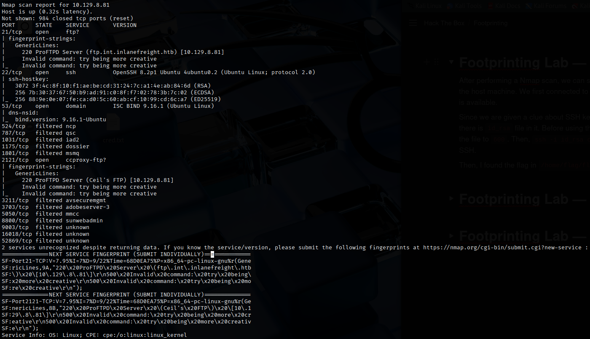
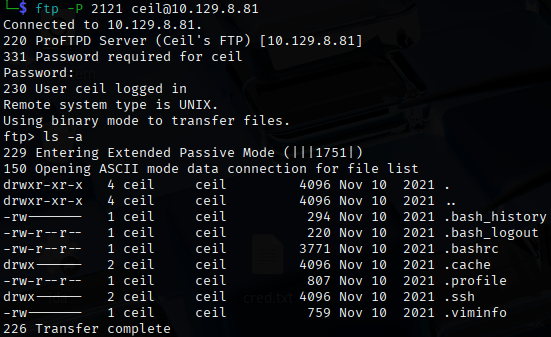

# Easy Lab
This lab features an internal DNS server that needs to be investigated. We are forbidden to attack the services aggressively using exploits as these services are in production. <br>
We are provided with the credentials `ceil:qwer1234` and they pointed out that some of the company's employees were talking about SSH keys on a forum. <br>
We need to obtain `flag.txt` on this server as proof of success.

## Approach
First, I performed a Nmap scan on the target to find out what services are running on the target.
```bash
nmap -sV -sC 10.129.8.81
```
 <br>
From the results, we can see that the target is running:
- FTP on port 21
- SSH on port 22
- Potential FTP service on port 2121 (Ceil's FTP)

Let's try connecting to the FTP service on port 21 using the provided credentials, `ceil:qwer1234`.
```bash
ftp -P 21 ceil@10.129.8.81
```
We successfully logged in to the FTP service, but it seems that we are not able to obtain any information from it.

Now, we try connecting to the FTP proxy service on port 2121 using the provided credentials, `ceil:qwer1234`.
```bash
ftp -P 2121 ceil@10.129.8.81
```
We successfully logged in and found something interesting.

 <br>
From the lab description, it seems that the flag could be found in the SSH service running on port 22.

This FTP service appears to be meant for Ceil, and we see a `.ssh` directory, which is common to store SSH keys for users. <br>
Look in the directory, we found a `id_rsa` private key file. We can use this file to authenticate ourselves as ceil.
```bash
## On the FTP server
ftp > get id_rsa

## On attacker machine
ssh -i id_rsa ceil@10.129.8.81
```
We have now gained SSH access on 10.129.8.81 and we found the flag in `/home/flag`

Flag: `HTB{7nr<REDACTED>hgj}`