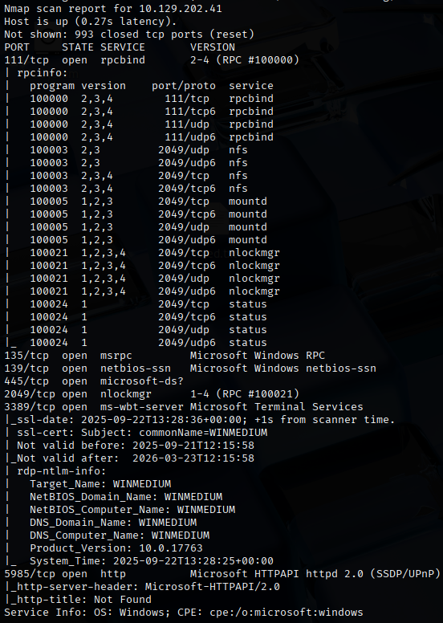
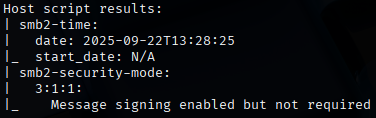
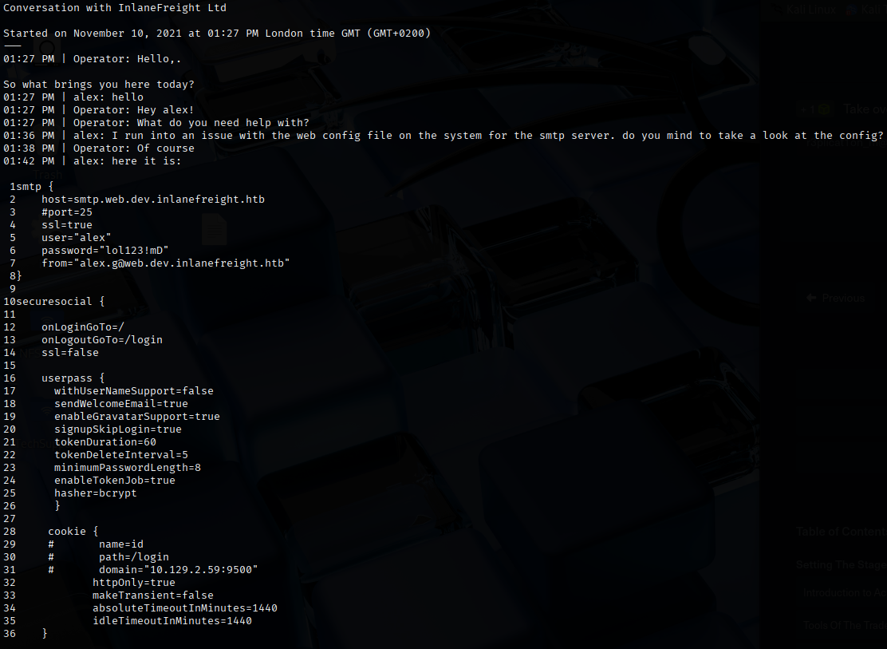
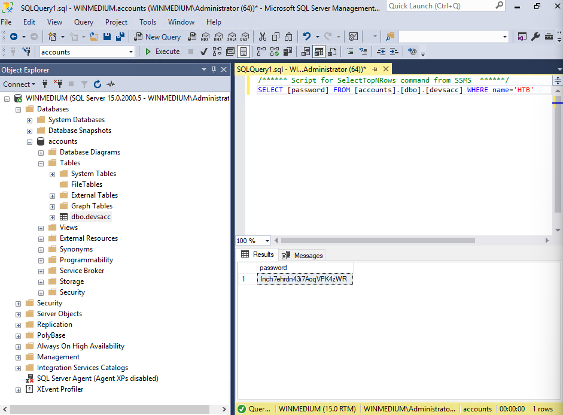

# Medium Lab
This lab is a server that everyone on the internal network has access to. These servers are often one of the main targets for attackers. <br>
For proof and protection of customer data, a user named `HTB` has been created. We need to find the password of this user as proof.

## Approach
First, we perform a Nmap scan on the target to find out services running on it.
```
nmap -sV -sC 10.129.202.41
```
 <br>
 <br>
From the results, we can find that the server is running:
- NFS on port 111
- SMB on port 139/445
- RDP on port 3389

Looking at the NFS service, we find that there is a `/TechSupport` share available to everyone.
```
showmount -e 10.129.202.41
```

We will proceed to mount the NFS share on our machine.
```
$ mkdir NFS-share
$ sudo mount -t nfs 10.129.202.41:/ ./NFS-share -o nolock
```
Looking at `NFS-share`, it seems that we cannot access the `/TechSupport` directory unless we are `nobody`.<br>
We can first try to access the directory by being `root`.
```
sudo su
```
We managed to access the `/TechSupport` directory as root user. <br>
It seems to contain many tickets, but most of the tickets are empty, except one ticket that is 1305 bytes, `ticket4238791283782.txt`.
The content of the ticket is as follows:

 <br>
We can see that the credential `alex:lol123!mD` is passed inside this ticket.

Let's try RDP with the new credentials that we found.
```
xfreerdp3 /v:10.129.202.41 /u:alex /p:'lol123!mD'
```
We successfully RDP-ed to the target on alex's account. <br>
From the command prompt, we found an interesting file, `important.txt` in `C:\Users\alex\devshare`.<br>
It seems to contain a credential `sa:87N1ns@slls83`.

Looking at the users in `C:\Users`, it seems that there is one other user, `Administrator`.

I attempted to RDP to 'sa' with the new set of credentials, but it seemed to fail. So, I tried to access the `Administrator` account with the password from `important.txt`.
```
xfreerdp3 /v:10.129.202.41 /u:Administrator /p:'87N1ns@slls83'
```
We successfully logged into the Administrator account.

I notice that there is MSSQL Service Management Studo on the machine. It could possibly store the credentials of our user, `HTB`. I connected to WINMEDIUM server with the Administrator credentials.

Looking at the database, it seems that every user's credentials are stored in `dbo.devsacc`, so I wrote a query to obtain the password for the user, `HTB`.

